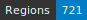

# HTRogène - Medieval Latin

   

## Introduction

HTRogène is an exploratory project funded by Biblissima+, aiming to develop generic models for automatic transcription of medieval and early modern manuscripts.  
This repository focuses on the Medieval Italian corpus, providing ground-truth data for Handwritten Text Recognition (HTR) and layout segmentation.  
The dataset is designed to support the creation of robust and reliable HTR models for Italian manuscripts.

| Shelfmark                                                                      | Links                                              |   Type |   Century | Color Pages   |   Main Zones |   Lines |   Characters | Genre                 |
|--------------------------------------------------------------------------------|----------------------------------------------------|--------|-----------|---------------|--------------|---------|--------------|-----------------------|
| Paris, Bibliothèque nationale de France, MS lat. 17226                         | [**B**](https://data.biblissima.fr/w/Item:Q62268)  |    nan |         7 | ✗             |           20 |     602 |         7085 | Narratives            |
| Saint-Omer, BM 764                                                             |                                                    |    nan |         9 | ✗             |           10 |     253 |         9582 | Narratives            |
| Angers, Archives départementales de Maine-et-Loire - H(039) 2 n° 176-177       |                                                    |    nan |        11 | ✗             |            1 |      37 |         3341 | Documents of practice |
| Angers, Archives départementales de Maine-et-Loire - H(045) 1 n° 4             |                                                    |    nan |        11 | ✗             |            1 |      52 |         2776 | Documents of practice |
| Le Havre, Bm 332                                                               | [**B**](https://data.biblissima.fr/w/Item:Q241805) |    nan |        11 | ✗             |           10 |     336 |        13387 | Narratives            |
| Semur-en-Auxois, Bibliothèque municipale, Ms. 1                                |                                                    |    nan |        11 | ✗             |           15 |     230 |         9555 | Narratives            |
| Archives départementales des Yvelines, 45H8 17                                 |                                                    |    nan |        12 | ✗             |            1 |      41 |         1662 | Documents of practice |
| Archives départementales des Yvelines, cote 45H8 8                             |                                                    |    nan |        12 | ✗             |            1 |       7 |          350 | Documents of practice |
| Besançon, Bibliothèque diocésaine - Par. 03                                    |                                                    |    nan |        12 | ✗             |            2 |      23 |         2163 | Documents of practice |
| Bruges. Bibliothèque publique, Ms. 403                                         | [**B**](https://data.biblissima.fr/w/Item:Q312351) |    nan |        12 | ✗             |           10 |     445 |        16693 | Narratives            |
| Laval, Archives de la Mayenne, H 154                                           |                                                    |    nan |        12 | ✗             |            9 |     388 |        10372 | Documents of practice |
| Liege, Archives de l'État, T51.12                                              |                                                    |    nan |        12 | ✗             |            1 |       5 |          292 | Documents of practice |
| Liege, Archives de l'État, T51.13                                              |                                                    |    nan |        12 | ✗             |            1 |      25 |         1716 | Documents of practice |
| Liege, Archives de l'État, T51.14                                              |                                                    |    nan |        12 | ✗             |            1 |      11 |          908 | Documents of practice |
| Paris, Bibliothèque de l'Ecole nationale supérieure des Beaux-Arts - Mn.Mas 38 | [**B**](https://data.biblissima.fr/w/Item:Q403823) |    nan |        12 | ✗             |            1 |      39 |         2130 | Documents of practice |
| Auxerre, Archives départementales de l'Yonne - H 2404                          | [**B**](https://data.biblissima.fr/w/Item:Q208407) |    nan |        13 | ✗             |            1 |      13 |         1086 | Documents of practice |
| Cambridge, Corpus Christi College, ms. 29                                      |                                                    |    nan |        13 | ✗             |           19 |    1608 |        41477 | Narratives            |
| Graz, Universitätsbibliothek, Ms. 1265                                         |                                                    |    nan |        13 | ✗             |           20 |     868 |        33793 | Treatises             |
| Nice, AM, AA 1/04                                                              |                                                    |    nan |        13 | ✗             |            1 |       9 |          811 | Documents of practice |
| Saint-Omer, BM 716, Tome 7                                                     | [**B**](https://data.biblissima.fr/w/Item:Q252687) |    nan |        13 | ✗             |           10 |     445 |        16780 | Narratives            |
| Paris, Archives nationales, LL 106B                                            |                                                    |    nan |        14 | ✗             |           12 |     171 |         4359 | Documents of practice |
| Paris, Archives nationales, LL 108A                                            |                                                    |    nan |        14 | ✗             |           25 |     561 |        15275 | Documents of practice |
| Paris, Archives nationales, LL 108B                                            |                                                    |    nan |        14 | ✗             |           26 |     372 |        12401 | Documents of practice |
| Paris, Bibliothèque nationale de France, MS. lat. 15168                        | [**B**](https://data.biblissima.fr/w/Item:Q61002)  |    nan |        14 | ✗             |           20 |     887 |        28072 | Treatises             |
| Paris, Archives nationales, LL 110                                             |                                                    |    nan |        15 | ✗             |           17 |     305 |         9405 | Documents of practice |
| Paris, Archives nationales, LL 125                                             |                                                    |    nan |        15 | ✗             |           10 |     436 |        18555 | Documents of practice |
| Paris, BIU Santé, Médecine, 5119                                               | [**B**](https://data.biblissima.fr/w/Item:Q180306) |    nan |        15 | ✗             |           11 |     331 |         9880 | Treatises             |
| Gent, BHSL.HS.0011                                                             |                                                    |    nan |        16 | ✗             |           15 |    1128 |        31383 | Treatises             |
| Paris, BnF, Smith-Lesouëf 35                                                   | [**B**](https://data.biblissima.fr/w/Item:Q106141) |    nan |        16 | ✗             |            6 |     127 |         4600 | Treatises             |

## Dataset Overview

The dataset comprises carefully selected manuscripts, each containing approximately 10 columns of text (equivalent to 5 bi-column pages or 10 single-column pages).  
The data adheres to the Segmonto guidelines, ensuring consistency and compatibility with other datasets following the same standards.  
Each image is accompanied by two XML files:

- Files suffixed with `.chocomufin.xml` are normalized for compliance with broader datasets.
- The other XML files contain repository-specific information.

We recommend using the normalized `.chocomufin.xml` files for most applications.

### Total number of pages

133

### Regions

- MainZone (277)
- TableZone (32)
- MarginTextZone (261)
- StampZone (14)
- NumberingZone (84)
- SealZone (3)
- DropCapitalZone (129)
- RunningTitleZone (38)
- DigitizationArtefactZone (56)
- GraphicZone (5)
- DamageZone (14)

### Lines

- DefaultLine (9179)
- HeadingLine (302)

## Funding and Support

This project is funded by Biblissima+, an observatory for medieval and Renaissance written cultural heritage.  
Biblissima+ focuses on the study of the circulation of books and the transmission of texts from the 8th to 18th centuries.  
Learn more at the [Biblissima+ project page](https://projet.biblissima.fr/fr/appels-projets/projets-retenus/htrogene).

## License

This dataset is licensed under the Creative Commons Attribution 4.0 International License (CC BY 4.0).  
You are free to share and adapt the material, provided appropriate credit is given.

## Citation

If you use this dataset in your research, please cite it as follows:

<!--Alba, Rachele; Rubin, Giorgia. (2023). HTRogene, Medieval Italian corpus of ground-truth for Handwritten Text Recognition and Layout Segmentation. Zenodo. https://doi.org/10.5281/zenodo.8272728-->

## Acknowledgments

We extend our gratitude to the transcribers and supervisors who contributed to the creation of this dataset.  

Special thanks to Biblissima+ for their financial support and commitment to advancing the study of medieval manuscripts.

For more information about the HTRogène project and other related resources, please visit the [Biblissima+ project page](https://projet.biblissima.fr/fr/appels-projets/projets-retenus/htrogene).
